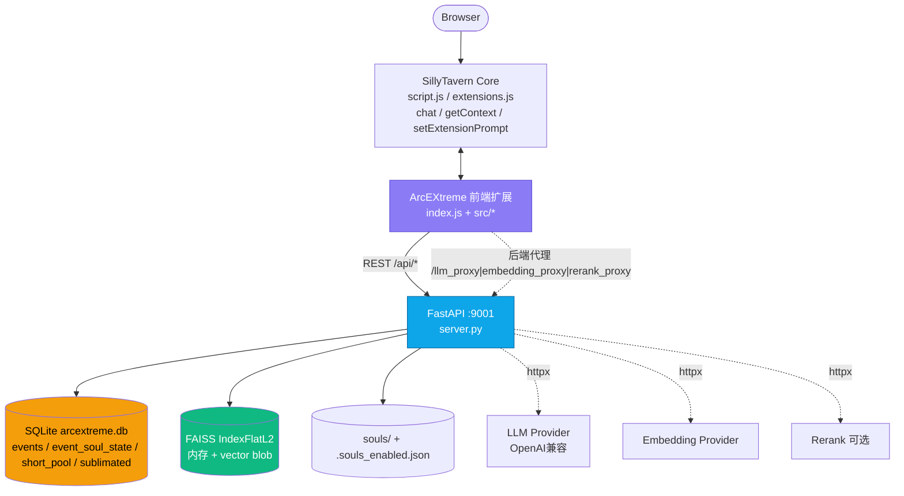
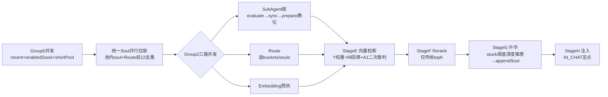

# ArcEXtreme 系统架构

> 前端扩展 `index.js` + `src/*` / 后端 `ArcEXtreme-BackEnd/server.py` · v0.1.x

## 1. 部署总览



## 2. 数据模型 `server.py:76`

| 表/文件 | 关键字段 | 说明 |
|---|---|---|
| `events` | `id, chat_id, timestamp/created_at/last_active_at, time_bucket, souls(JSON), event_text, vector(blob), counter` | 全量事件，按 `chat_id` 隔离，8档分桶 `BUCKETS:34` |
| `event_soul_state` | `event_id, soul, counter(0-3), skip, stuck, birth_ts, why_init, why_log(JSON)` | 2-bit 饱和计数器状态，`0强拒绝/1弱拒绝/2弱接纳/3强接纳` |
| `short_pool` | `chat_id, soul, event_id` | perSoul BTB 短期池，`perSoulCap=15` `server.py:344` |
| `sublimated` | `chat_id, soul, event_id, title, content` | `stuck≥8` 强态升华固化 `server.py:135` |
| `souls/*.md` + `.souls_enabled.json` | `name, filename, enabled` | B方案后端持久化启用表 `server.py:528` |

向量：`vector_to_blob:167` 入库，`FAISS IndexFlatL2:312` 内存索引，`load_index:280` 启动重建。

## 3. 双流水线

### 写入 `index.js:168 onUserMessage`

```
用户消息 → extractEvents(按启用soul 1:1, counter∈{1,2}+why 70-200字) → embedTexts → insertBatch(perSoulCap) → BTB逐出(skip>3优先 else birth中位数)
```
`soulsContentsMapForExtract:247` 全量拉取 soul 原文保证 2bit 初值有据。

### 读取 `index.js:312 arcextreme_generate` — 7步拦截



* **SubAgent** `src/subAgents.js` `config.js:78`：每池事件 `+1/-1/Skip`，模式 `perRole|mixed|perEvent:212`，`A1 retrievedSubAgent:223` 检索结果二次裁判
* **路由** `src/router.js` `config.js:64`：LLM 选 `buckets + souls`
* **检索** `server.py:449 query`：FAISS 粗排 → `weightMultipliers:534 score'=score*Y[n]` → `short_pool/fill` 回填空位
* **升华** `src/sublimation.js` `config.js:100`：`checkSublimation` 强态候选 → LLM 提炼追加至 soul 末尾 `server.py:595`

TTFT 优化 `bb54224`：Group0/Group2 全并发，Soul `Promise.all` 去重拉取，不削减 LLM 调用。

## 4. 目录映射

```
index.js          总控 + 双流水线 + 注入
src/config.js     BUCKETS/提示词模板/defaultSettings
src/backend.js    REST 封装 + 局域网地址修正
src/eventExtract|router|subAgents|sublimation|embeddings|rerank  各LLM调用
src/shortPool|twoBit  BTB/2bit逻辑
src/inject.js     buildRecent/Retrieved/ShortPool/Sublimated + setExtensionPrompt
src/ui|trace      面板/流水线点/日志
server.py         FastAPI + SQLite + FAISS + souls CRUD + /api/chats 迁移备份
```
