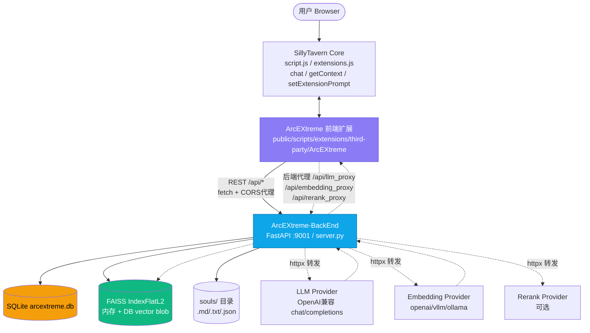

# ArcEXtreme 系统架构图

> 基于 v0.1.0 实际代码逆向 — 前端扩展 + Python 后端 + 外部 LLM/Embedding

## 1. 总览 Deployment 架构

```mermaid
flowchart TB
    User([用户 Browser])
    ST[SillyTavern Core<br/>script.js / extensions.js<br/>chat / getContext / setExtensionPrompt]
    EXT[ArcEXtreme 前端扩展<br/>public/scripts/extensions/third-party/ArcEXtreme]
    BE[ArcEXtreme-BackEnd<br/>FastAPI :9001 / server.py]
    DB[(SQLite arcextreme.db)]
    FAISS[(FAISS IndexFlatL2<br/>内存 + DB vector blob)]
    SOULS[(souls/ 目录<br/>.md/.txt/.json)]
    LLM[LLM Provider<br/>OpenAI兼容 chat/completions]
    EMB[Embedding Provider<br/>openai/vllm/ollama]
    RERANK[Rerank Provider<br/>可选]

    User --> ST
    ST <--> EXT
    EXT -- "REST /api/*<br/>fetch + CORS代理" --> BE
    BE --> DB
    BE --> FAISS
    BE --> SOULS

    EXT -.->|后端代理 /api/llm_proxy<br/>/api/embedding_proxy<br/>/api/rerank_proxy| BE
    BE -.->|httpx 转发| LLM
    BE -.->|httpx 转发| EMB
    BE -.->|httpx 转发| RERANK

    LLM -.-> BE -.-> EXT
    EMB -.-> BE -.-> FAISS

    style EXT fill:#8B7CF6,stroke:#5B4BD5,color:#fff
    style BE fill:#0EA5E9,stroke:#0369A1,color:#fff
    style DB fill:#F59E0B,color:#000
    style FAISS fill:#10B981,color:#fff
```
